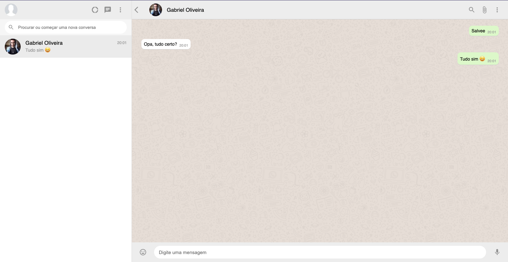

# WhatsApp Clone

  

  <b>Clone funcional do WhatsApp.</b>

 

    

## Conteúdo

- [Sobre](#sobre)
- [Tecnologias](#tecnologias)
- [Pré-requisitos](#pre-requisitos)
- [Como usar](#como-usar)
- [Como contibuir](#como-contribuir)

## :bookmark: Sobre

O clone do WhatsApp é uma aplicação em React em que é utilizado login Auth com o Facebook através do Firebase, armazenamento de usuários e mensagens no firebase, sendo possível acessar a qualquer momento e visualizar as mensagens e conversas realizadas. Foi colocado também a opção de transcrição de mensagens automáticas clicando no ícone de microfone do chat. Esse projeto foi realizado em um módulo de React da B7Web ministrada por Bonieky Lacerda.

## :rocket: Tecnologias Utilizadas

O projeto foi desenvolvido utilizando as seguintes tecnologias

- [JavaScript](https://javascript.com/)
- [ReactJS](https://reactjs.org/)
- [FireBase](http://firebase.google.com/)

## :fire: **Pré-requisitos**

- [Node.js](https://nodejs.org/en/)
- [NPM](https://www.npmjs.com/) ou [Yarn](https://yarnpkg.com/)

## :zap: Como usar

- Faça um clone desse repositório: `git clone https://github.com/Oliveiiraa/WhatsApp-Clone.git`

- Entre na pasta: `cd WhatsApp-Clone`

- Instale as dependências: `yarn install` ou `npm install`

- Crie um arquivo `firebaseConfig.js` com suas configurações do Firebase

- Rode o comando de inicialização: `yarn start` ou `npm start`

## :recycle: Como contribuir

- Faça um Fork desse repositório,
- Crie uma branch com a sua feature: `git checkout -b my-feature`
- Commit suas mudanças: `git commit -m 'feat: My new feature'`
- Push a sua branch: `git push origin my-feature`

---

<h4 align=center>Made with 💙 by <a href="https://www.linkedin.com/in/gabriel-h-oliveira/">Gabriel Oliveira</a></h4>